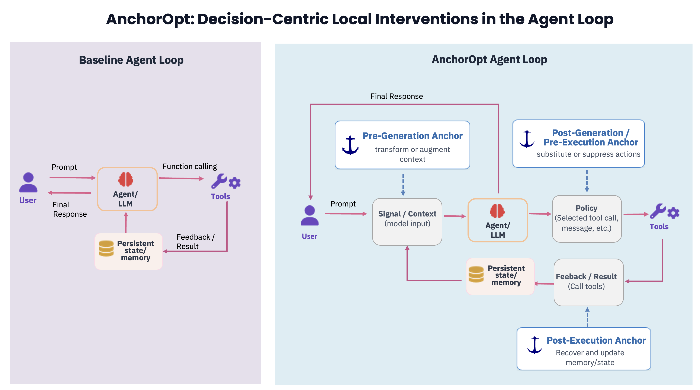

# AnchorOpt

**Structured runtime optimization in agent harnesses.**

An agent harness governs consequential decisions around a language model: whether to invoke a tool, commit a state change, recover from an error, or terminate. AnchorOpt exposes these as **runtime decision boundaries** and decomposes harness adaptation into **constrained local control problems**: it mines residual failures, attributes each one backward to the decision that made it avoidable, locates where the system can act, and installs validated controllers — called **anchors** — sequentially against a moving incumbent, re-mining after every acceptance.

> **Observational data proposes; counterfactual measurement decides.** A controller is mined from observed failures and retained only by paired counterfactual measurement against the current incumbent — not hand-written into a global prompt and not fit with gradients.



The baseline loop (left) has one lever: the prompt. The AnchorOpt loop (right) makes the step
**inspectable** — model input, selected action, and tool result become named objects, and each is a
place the *system* can act. The three dashed boxes are the three **incision points**; every anchor in
this repo is one of them. See [`docs/INCISION_POINTS.md`](docs/INCISION_POINTS.md).

---

## Headline results

$H_0$ is the native harness with no AnchorOpt controller installed. `Δpp` (percentage points) is the
figure to quote, not relative percent — see [`docs/METRICS.md`](docs/METRICS.md) for why. GEPA and
Self-Harness are the two baselines AnchorOpt is compared against in the paper — GEPA as a
prompt-optimization baseline, Self-Harness as an earlier internally-built harness.

### Reproduce this part yourself — no model, no GPU

Recomputes every number in this subsection from the shipped per-case data:

```bash
pip install -e ".[dev]" && python scripts/verify_progression.py
```

**BFCL v4 Memory** — granite-4.1-8B, eight sequentially learned anchors, no global prompt:

| split | H0 | AnchorOpt | Δpp |
|---|---:|---:|---:|
| train (n=303) | 30.03% | **52.48%** | **+22.44** |
| dev (n=84, selected-on) | 16.67% | **48.81%** | **+32.14** |

**AppWorld** — pass %, one anchor per model, held-out scored only after promotion on held-in:

| model | H0 held-in | AnchorOpt | Δpp | H0 held-out | AnchorOpt | Δpp |
|---|---:|---:|---:|---:|---:|---:|
| MiniMax M2.5 | 65.6 | **70.6** | **+5.0** | 55.2 | **60.6** | **+5.4** |
| granite-4.1-30b | 30.0 | **33.3** | **+3.3** | 26.7 | **30.0** | **+3.3** |
| Qwen3.6-35B-A3B (local) | 74.4 | *no anchor* | — | 56.7 | *no anchor* | — |

The dev/held-in splits were consulted during selection, so they are **validation sets, not clean
generalization estimates**; `no anchor` means measured and rejected, not untried. Full round-by-round
progression, per-backend breakdown, and leaderboard context:
[`docs/BFCL_PROGRESSION.md`](docs/BFCL_PROGRESSION.md). What each anchor does, its evidence and its
caveats: [`docs/ANCHORS.md`](docs/ANCHORS.md).

Plus **E1**, an exploratory efficiency anchor on a **second objective** — accuracy per LLM call, where a
+0.00 pp accuracy delta is a pass: 16 of 16 redundant executions removed, transcribed rather than
re-measured here. Full scope and caveats: [`docs/ANCHORS.md`](docs/ANCHORS.md).

### The paper's full results

These are **reported figures transcribed from the paper**. The **per-case data and campaign artifacts**
behind most of these cells are not shipped in this repo (see
[`docs/RESULTS_POLICY.md`](docs/RESULTS_POLICY.md)); the two rows above are the subset this repo
re-derives independently. Full provenance and the GEPA-composition study:
[`docs/PAPER_RESULTS.md`](docs/PAPER_RESULTS.md).

**BFCL v4 Agent Memory** — strict task success (%):

| Model | Split | H0 | GEPA | Self-Harness | AnchorOpt |
|---|---|---:|---:|---:|---:|
| MiniMax M2.5 | train | 23.7% | 34.0% (+10.3pp) | $H_0$ retained | 26.0% (+2.2pp) |
| MiniMax M2.5 | held-out | 42.7% | 58.7% (+16.0pp) | $H_0$ retained | 46.7% (+4.0pp) |
| Qwen3.6-35B | train | 39.8% | 39.3% (−0.5pp) | $H_0$ retained | $H_0$ retained |
| Qwen3.6-35B | held-out | 19.1% | 35.7% (+16.7pp) | $H_0$ retained | $H_0$ retained |
| Opus → Granite 4.1-8B | train | 30.0% | 31.0% (+1.0pp) | 31.9% (+1.9pp) | 37.6% (+7.6pp) |
| Opus → Granite 4.1-8B | held-out | 16.7% | 19.1% (+2.4pp) | 19.8% (+3.1pp) | 21.4% (+4.8pp) |

**AppWorld** — task-goal completion (TGC, %):

| Model | Split | H0 | GEPA | Self-Harness | AnchorOpt |
|---|---|---:|---:|---:|---:|
| MiniMax M2.5 | train | 65.6% | 71.1% (+5.5pp) | 68.9% (+3.3pp) | 70.6% (+5.0pp) |
| MiniMax M2.5 | held-out | 54.4% / 55.2% | 62.8% (+8.3pp) | 61.7% (+7.2pp) | 60.6% (+5.4pp) |
| Qwen3.6-35B | train | 75.6% | 71.7% (−3.9pp) | $H_0$ retained | $H_0$ retained |
| Qwen3.6-35B | held-out | 58.9% | 51.1% (−7.8pp) | $H_0$ retained | $H_0$ retained |
| Granite 4.1-30B | train | 30.0% | $H_0$ retained | $H_0$ retained | 33.3% (+3.3pp) |
| Granite 4.1-30B | held-out | 26.7% | $H_0$ retained | $H_0$ retained | 30.0% (+3.3pp) |

**tau2-bench** — repeated-execution reliability, Granite 4.1-30B, airline tasks (n=20). `pass^k` is
success in all `k` executions of the same task:

| Metric | H0 | AnchorOpt | Gain (pp) |
|---|---:|---:|---:|
| pass¹ | 0.188 | **0.350** | +16.2 |
| pass⁴ | 0.000 | **0.350** | +35.0 |

`$H_0$ retained` means the method's search measured candidates and did not find one that beat the
incumbent on that split — a reported null, not an untried cell. [`docs/PAPER_RESULTS.md`](docs/PAPER_RESULTS.md)
also has the GEPA-composition study (a local AnchorOpt controller on top of a frozen GEPA-optimized
prompt) and Algorithm 1, the loop below formalized.

### Full reproduction, any budget

| if you want to | read |
|---|---|
| the one-command check above, plus the test suite | [`REPRODUCE.md`](REPRODUCE.md) (tier 1) |
| run the method end to end with no GPU, no model | `python scripts/walk_framework.py`, [`examples/toy_host/`](examples/toy_host/) |
| re-run a benchmark adapter on your own compute | [`REPRODUCE.md`](REPRODUCE.md) (tiers 2–3), per-adapter READMEs under [`benchmarks/`](benchmarks/) |
| port AnchorOpt to a new benchmark | [`docs/ADAPTER_GUIDE.md`](docs/ADAPTER_GUIDE.md), [`adapters/adapter_template.py`](adapters/adapter_template.py) |
| know what `net`, `Δpp`, the noise floor or the four acceptance criteria mean | [`docs/METRICS.md`](docs/METRICS.md) |
| know what is broken or contested | [`docs/KNOWN_ISSUES.md`](docs/KNOWN_ISSUES.md) |

### Install

```bash
git clone <this-repo> anchoropt && cd anchoropt
uv venv --python 3.12 && source .venv/bin/activate
uv pip install -e ".[dev]"
python -m pytest tests/ -q
```

---

## The five benchmark adapters

AnchorOpt is benchmark-agnostic: the core (`anchoropt/`) never imports a benchmark. Each adapter binds
it to one host through a declared contract (`anchoropt/testing/adapter_contract.py`, checkable with no
model via `scripts/check_adapter.py`). The five are at genuinely different maturity levels, stated
rather than averaged — see each adapter's own README for what it actually gets you:

| benchmark | adapter | entry point | maturity |
|---|---|---|---|
| **AppWorld** | [`benchmarks/appworld/`](benchmarks/appworld/) | `run_round.py` | reference implementation — headroom screening, behavioural probes, a held-out driver |
| **BFCL v4** | [`benchmarks/bfcl_v4/`](benchmarks/bfcl_v4/) | `run.py` | the original — where the progression above was measured |
| **CCTU** | [`benchmarks/cctu/`](benchmarks/cctu/) | `cctu_run_arms.py` | complete; ships transcripts for CPU-only re-scoring |
| **τ² (tau2)** | [`benchmarks/tau2/`](benchmarks/tau2/) | `run_anchoropt_round.py` | complete, with a capability audit |
| **TB2 / deepagents** | [`benchmarks/tb2_deepagents/`](benchmarks/tb2_deepagents/) | `tb2_adapter.py` | thinnest — treat as a porting example |

Write your own against [`adapters/adapter_template.py`](adapters/adapter_template.py): the template's
TODOs are the mandatory hooks, and the optional ones buy capability rather than correctness.

---

## What this is, and why "anchor"

Tool-using agents often fail locally: an invalid call, a redundant write, a destructive action, or an
answer produced without consulting memory. The obvious response is to add prompts, validators, or
guardrails. AnchorOpt asks a harder question first: **which observed behaviors are actually worth
intervening on?** A frequent error may be only a downstream symptom; a rarer upstream decision may
cause many later failures. AnchorOpt starts from task reward, works backward to the responsible
decision, and intervenes only where the evidence supports doing so.

The loop: **mine** residual failures → **attribute** each backward to the decision that made it
avoidable → **locate** the decision point where that condition is observable → **prune** to feasible
local interventions → **measure** a paired counterfactual arm → **persist and re-mine**. The residual
is **endogenous**: installing one anchor changes the world the next anchor is learned in.

An anchor is `(failure context, attribution, decision point, action)` — local (it acts at one decision
point, not globally) and grounded (every part of it is backed by trajectory evidence and counterfactual
measurement, not hand-authored).

```
Algorithm 1: AnchorOpt — residual-driven optimization

Require: Native harness H0, initial signals Φ0, budget B
 1:  P ← ∅, Φ ← Φ0
 2:  T ← Execute(H0)
 3:  while budget remains do
 4:      H ← H0 ⊕ P
 5:      F ← DiagnoseResiduals(T)
 6:      if Stop(F) then return P
 7:      L_c ← ConsequentialBoundaries(F, H)
 8:      A_c ← SearchFeasiblePolicies(L_c, Φ, H)        # Fix Φ
 9:      A* ← EvaluateAndSelect(A_c, H)
10:      if A* ≠ ∅ then
11:          P ← P ⊕ A*
12:          T ← Execute(H0 ⊕ P)
13:          continue                                    # Re-mine residuals
14:      if budget exhausted then return P
15:      Φ' ← ExpandSignals(F, L_c, Φ)                   # Fix P
16:      if Φ' = Φ then return P
17:      Φ ← Φ'
18: return P
```

Line 8 and line 15 are never reached in the same iteration — a round either searches for a local policy
with the signal vocabulary held fixed, or expands the signal vocabulary with the installed policy held
fixed, never both. T4 in the BFCL progression above is that block-coordinate structure caught in the
act: a round where search finds nothing and signals expand instead of a controller being installed. Full
walkthrough mapped onto the shipped code: [`docs/PAPER_RESULTS.md`](docs/PAPER_RESULTS.md#algorithm-residual-driven-optimization).

**The decision principle stays general; the feasible action is conditional on the substrate.** As re-mining proceeds, anchors specialize to the mechanics of an individual memory backend (`vector`, `rec_sum`, `kv`) — which looks at first like a retreat into per-backend hacks, but the better abstraction is that one principle covers all three: *when memory is under capacity pressure, preserve information before resorting to destructive recovery*, and the substrate decides how to obey it (remove a redundant copy; compress a blob; deduplicate a slot). This framing is **falsifiable, not decorative**: on a **saturated** substrate with no information-preserving action available, the correct branch is to **fall back** rather than force a repair — see [`docs/GENERALIZABILITY.md`](docs/GENERALIZABILITY.md) for the full argument, the ordered action ladder it predicts, and the deferred anchor that tests it.

Full method: [`docs/THE_LOOP.md`](docs/THE_LOOP.md) · the three decision points and why they matter more
than the action: [`docs/INCISION_POINTS.md`](docs/INCISION_POINTS.md) · how a candidate becomes an
accepted anchor: [`docs/ACCEPTANCE_RULE.md`](docs/ACCEPTANCE_RULE.md) · comparison to global prompting
and RL/fine-tuning: [`docs/GENERALIZABILITY.md`](docs/GENERALIZABILITY.md) · the typed anchor object:
[`anchoropt/anchor.py`](anchoropt/anchor.py).

---

## Repository map

**The numbers.** Every figure in this repo is data in one file, and prose never restates one:

| path | purpose |
|---|---|
| [`rounds/anchors.py`](rounds/anchors.py) | **the single source of truth** — every accuracy, the acceptance rule, the deferred anchor. Tests pin the docs to it |
| [`rounds/`](rounds/) | one directory per round that this repo can reproduce or verify: acceptance criteria, mined ledgers, learned policy, per-case results |

**The method, as code.**

| path | purpose |
|---|---|
| [`anchoropt/anchor.py`](anchoropt/anchor.py) | the anchor object, the three decision points, the feasible-action grid |
| [`anchoropt/attribution/`](anchoropt/attribution/) | failure canonicalization and backward attribution |
| [`anchoropt/learning/`](anchoropt/learning/) | candidate ranking, re-mining, signal expansion, the exposure/displacement diagnostics |
| [`anchoropt/mechanisms/`](anchoropt/mechanisms/) | one module per anchor, plus [`constraint_repair.py`](anchoropt/mechanisms/constraint_repair.py) — the shared control flow and the adapter porting seam |

**Things you can run with no GPU:**

| command | what it does |
|---|---|
| `pytest` | the whole integrity suite — numbers, docs, mechanisms |
| `python scripts/verify_progression.py` | recomputes the shipped accuracies per case and fails loudly on drift |
| `python scripts/walk_framework.py` | steps through the method on the real artifacts |
| `python scripts/run_pipeline.py --show \| --expect` | the composed policy, and what a full run must produce |
| `python scripts/derive_per_backend.py` | cross-checks the per-backend cells two ways |
| `python benchmarks/bfcl_v4/run.py --compare --shard all --dry-run` | the six concurrent commands a real run needs |

**Needs a GPU and a served model:** the arms themselves. See each adapter's README under
[`benchmarks/`](benchmarks/) and [`REPRODUCE.md`](REPRODUCE.md) for the tiered guide to running them on
your own compute.

### Everything else, by what you want to do

| if you want to | read |
|---|---|
| see provenance for the paper's tables, the GEPA-composition study, and Algorithm 1 mapped onto the code | [`docs/PAPER_RESULTS.md`](docs/PAPER_RESULTS.md) |
| understand the results in depth | [`docs/ANCHORS.md`](docs/ANCHORS.md) (what each anchor does, evidence, caveats), [`docs/ACCEPTANCE_RULE.md`](docs/ACCEPTANCE_RULE.md) (the audit of every candidate, including rejected and deferred ones) |
| port to another benchmark | [`docs/ADAPTER_GUIDE.md`](docs/ADAPTER_GUIDE.md), [`examples/toy_host/`](examples/toy_host/) (a complete deterministic reference adapter + host, no GPU: `python examples/toy_host/demo.py --no-late-repair`), [`docs/GENERALIZABILITY.md`](docs/GENERALIZABILITY.md) |
| understand the method in depth | [`docs/THE_LOOP.md`](docs/THE_LOOP.md), [`docs/INCISION_POINTS.md`](docs/INCISION_POINTS.md), [`docs/KEEP_OR_DEFER.md`](docs/KEEP_OR_DEFER.md), [`docs/OBSERVABILITY_VS_DECISION_CONTEXT.md`](docs/OBSERVABILITY_VS_DECISION_CONTEXT.md) |
| compare against global prompting and RL/fine-tuning | [`docs/GENERALIZABILITY.md`](docs/GENERALIZABILITY.md) |
| re-run everything | [`REPRODUCE.md`](REPRODUCE.md), [`docs/FIDELITY_AUDIT.md`](docs/FIDELITY_AUDIT.md) |

---

## Status

- **A1–A4:** frozen accuracy anchors; policies and per-case results shipped.
- **Offline verification:** available without a GPU.
- **E1:** exploratory efficiency anchor; weaker evidence than A1–A4.
- **Signal expansion:** ongoing.
- **Benchmark scope:** end-to-end learning has currently been demonstrated on BFCL v4 Memory; AppWorld, CCTU, τ² and TB2/deepagents are adapters at varying maturity (see the table above).
- **Portability abstraction:** intentionally limited until the method has been exercised on more benchmarks.

AnchorOpt is a work in progress. The current goal is not to accumulate rules indefinitely, but to test
whether explicit decision points, backward attribution, and counterfactual local policy improvement
provide a systematic way to improve tool-using agents.
